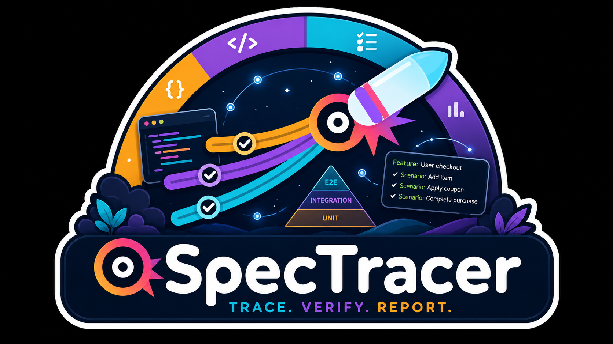
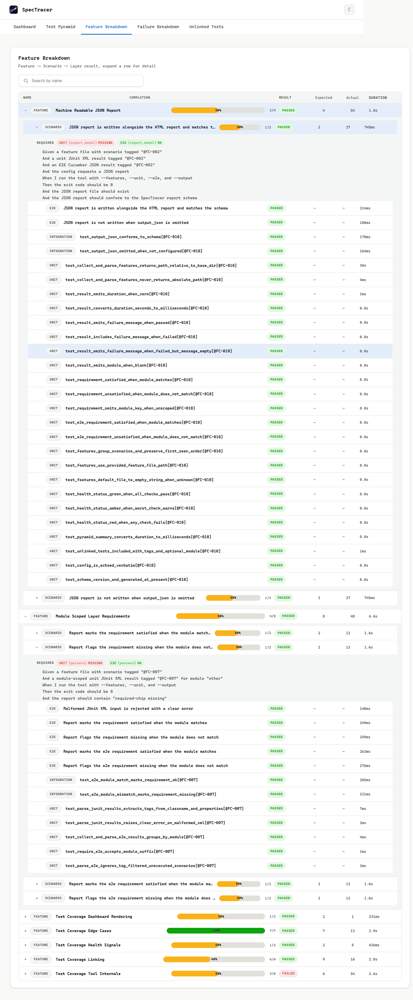

# SpecTracer

<div align="center">
</img>

<p>

[](https://lbesson.mit-license.org/)   [](https://github.com/ampyard/spec-tracer/actions/workflows/ci.yml)

</p>
</div>

A CLI tool that takes your Gherkin `.feature` files as the source of truth for what needs testing, then collates test results from your **Unit**, **Integration**, and **E2E** suites into a single, self-contained HTML report — plus an optional machine-readable JSON twin for CI automation.

Feature files define the scope. Tags on scenarios link them to test results across layers. The report shows:

- What percentage of scenarios actually have test completion (the headline metric).
- Where that coverage exists across layers (per-scenario pass/fail/skip breakdown).
- The overall test pyramid — test count, duration, and pass rate per layer.
- Every failure's stack trace, in one place.

An optional JSON report (conforming to [`spectracer-report.schema.json`](spectracer-report.schema.json)) mirrors the same data for scripting — PR bots, custom gating, dashboards — without scraping HTML.

The tool is tech-stack agnostic: it only needs Gherkin `.feature` files, JUnit XML, and Cucumber JSON, so it works regardless of what languages or frameworks produced them.

## Why

- **Fragmented visibility** — unit, integration, and E2E tests usually live in different directories or repos, with no single view of overall coverage.
- **Inverted pyramids** — teams unknowingly accumulate slow E2E tests instead of fast unit tests, and don't notice until CI is painfully slow.
- **No traceability** — it's hard to know if a specific business scenario is actually complete across all the layers it should.
- **Tooling lock-in** — most reporting tools are tied to one framework (Allure for Java, Cypress Dashboard for Cypress). This one isn't.

## Installation

Requires Python 3.12+.

```bash
pip install spec-tracer
```

Or with uv:

```bash
uv pip install spec-tracer
```

Once installed, the `spec-tracer` CLI is available globally.

### From source

```bash
git clone https://github.com/ampyard/spec-tracer.git
cd spec-tracer
uv sync
```

To build a wheel for local testing:

```bash
uv build
```

The wheel is written to `dist/spec_tracer-*.whl`. Install it with `uv pip install dist/*.whl`.

## Quick Start

1. Write `.feature` files describing your scenarios, tagged so test results can link back to them (see [Tagging Convention](#tagging-convention) below).
2. Run your test suites and produce JUnit XML (unit/integration) and/or Cucumber JSON (E2E) output.
3. Create a `specspectracer.config.json` in your project root:

   ```json
   {
     "features": ["./features"],
     "unit": { "": ["./reports/unit.xml"] },
     "integration": { "": ["./reports/integration.xml"] },
     "e2e": { "": ["./reports/e2e.json"] },
     "output": "./report.html"
   }
   ```

4. Run the tool:

   ```bash
   uv run python build_pyramid.py
   ```

   It auto-discovers `spectracer.config.json` in the current directory — no flags needed. Open the generated `report.html` in a browser.

To point at a config file with a different name or location, pass it as the only argument:

```bash
uv run python build_pyramid.py path/to/other-config.json
```

> **Note on shells:** use forward slashes (`./spectracer.config.json`) or a bare filename. A leading `.\` (PowerShell-style) can be mangled by POSIX-style shells (Git Bash, WSL), since backslash is their escape character there.

## Tagging Convention

Feature files and test results connect via **shared tags**. There are two kinds of tags a scenario can carry:

```gherkin
Feature: User Login

  @FC-42 @regression @require-unit:auth @require-integration:auth @require-e2e:auth
  Scenario: Successful login with valid credentials
    Given the user is on the login page
    When they enter valid credentials
    Then they should be redirected to the dashboard

  @FC-43
  Scenario: Login with invalid password shows error
    Given the user is on the login page
    When they enter an invalid password
    Then an error message should be displayed
```

- **Linking tags** (`@FC-42`, `@regression`) — shared with test results. Any test result carrying a matching tag links to that scenario.
- **Layer requirement tags** (`@require-unit`, `@require-integration`, `@require-e2e`) — declare which layers *must* have coverage for this scenario. These are never used for linking, and the tool flags any declared layer that ends up with zero linked results.

### Module-scoped requirements

`@require-unit`, `@require-integration`, and `@require-e2e` accept an optional `:modulename` suffix, e.g. `@require-unit:auth` or `@require-e2e:checkout`. This pairs with module-keyed entries in the config file's `unit`/`integration`/`e2e` objects (see below) — a module-scoped requirement is only satisfied by a result registered under that exact module. An unscoped result (config key `""`) never satisfies it, and a bare `@require-unit` / `@require-e2e` (no module) is satisfied by any linked result for that layer regardless of module.

### Matching rules

- **Exact string match** — `@FC-42` matches `@FC-42` only, not `@FC-4` or `@FC-42-smoke`.
- **OR logic** — a scenario tagged `[@FC-42, @regression]` links to a test carrying just `@regression`.
- **Scenario tags only** — tags on the `Feature:` line are **not** inherited by scenarios.
- **`@require-*` tags** are excluded from linking — no collision with linking tags is possible.
- **Tag collisions link everywhere** — if two scenarios (in the same or different feature files) share a tag, one matching test result links to both.

### Where the tool looks for tags in test results

- **JUnit XML (unit/integration):** the `name` attribute, `classname` attribute, or `<properties><property>` elements — whichever your framework populates.
- **Cucumber JSON (E2E):** the native scenario-level `tags` array.

## Configuration File

The tool is configured entirely through a JSON file — there are no CLI flags. Default filename is `spectracer.config.json` at the project root; pass an explicit path as the sole CLI argument to use a different one.

```json
{
  "features": ["./features"],
  "unit": {
    "": ["./reports/unit.xml"],
    "billing": ["./reports/billing-unit.xml"]
  },
  "integration": {
    "": ["./reports/integration.xml"]
  },
  "e2e": {
    "": ["./reports/e2e.json"],
    "checkout": ["./reports/checkout-e2e.json"]
  },
  "output": "./report.html",
  "output_json": "./report.json",
  "error_on_failure": false,
  "health_checks": {
    "progress_threshold_green": 80,
    "progress_threshold_amber": 50,
    "e2e_duration_amber_seconds": 600,
    "e2e_duration_red_seconds": 1800
  }
}
```

| Key | Required | Description |
|---|---|---|
| `features` | Yes | Array of Gherkin `.feature` file or directory paths (directories are searched recursively). |
| `unit` | No | Object keyed by module name. Each value is an array of JUnit XML file/directory paths. Use `""` as the key for results not tied to any module. Matched against `@require-unit` / `@require-unit:<module>` tags. |
| `integration` | No | Same shape as `unit`, matched against `@require-integration` / `@require-integration:<module>` tags. |
| `e2e` | No | Same shape as `unit`, but for Cucumber JSON file/directory paths. Matched against `@require-e2e` / `@require-e2e:<module>` tags. |
| `output` | Yes | Path for the generated HTML report. Created if the parent directory doesn't exist; overwritten if it already exists. |
| `output_json` | No | Path for a machine-readable JSON report, conforming to [`spectracer-report.schema.json`](spectracer-report.schema.json). Omit to skip JSON output entirely (default). Same directory-creation/overwrite semantics as `output`. |
| `error_on_failure` | No | If `true`, exit non-zero when any test result is a failure. Default: `false`. Health checks never affect the exit code — this is the only thing that does. |
| `health_checks` | No | Overrides for the default thresholds shown above. |

## The Report

The generated HTML is a single self-contained file (all CSS/JS inlined — no external assets, safe to email or archive) with five sections:



1. **Coverage Progress Summary** — the headline `Tested: X / Y scenarios (Z%)` metric, plus a per-feature breakdown. Color-coded green/amber/red using the configurable thresholds.
2. **Global Pyramid Dashboard** — a 3-tier visualization (E2E / Integration / Unit) with test counts, duration, and pass rate per layer, plus health indicators for an inverted pyramid or an E2E layer with excessive runtime.
3. **Feature Traceability & Scenario Matrix** — a searchable, expandable tree: Feature → Scenario → Layer results, with full Gherkin text, declared layer requirements (✓/✗), and per-test pass/fail/skip status with failure stack traces.
4. **Detailed Failure Breakdown** — every failed test across all layers, with feature/scenario context and full stack trace on expand.
5. **Unlinked Tests** — test results whose tags didn't match any scenario, to help catch orphaned or mis-tagged tests.

## Machine-Readable JSON Report

Setting `output_json` in the config produces a JSON file alongside the HTML report, built from the exact same internal data — the two outputs can never drift apart. It conforms to [`spectracer-report.schema.json`](spectracer-report.schema.json) (Draft 7), which is the authoritative contract; the highlights:

- `summary.completion` / `summary.pyramid` / `summary.health` — the same headline metric, per-layer stats, and health status (`green`/`amber`/`red` with `reasons[]`) shown on the HTML dashboard.
- `features[].scenarios[].results[]` — every linked test result per scenario, with `duration` (milliseconds) and `failureMessage` **omitted** rather than `null` when not available, and layer requirement satisfaction under `requirements[]`.
- `unlinkedTests[]` — the same orphaned results shown in the HTML report's "Unlinked Tests" page.
- `config` — a verbatim echo of the resolved config used to produce the report, for provenance if the JSON is archived independently of the repo.

```json
{
  "features": ["./features"],
  "unit": { "": ["./reports/unit.xml"] },
  "e2e": { "": ["./reports/e2e.json"] },
  "output": "./report.html",
  "output_json": "./report.json"
}
```

Useful for PR bots, custom CI gating beyond `error_on_failure`, or feeding coverage numbers into a dashboard — without scraping the HTML.

## Behavior Reference

| Scenario | Behavior |
|---|---|
| No config file found and none specified | Errors out — a config file is mandatory. |
| Config missing `features` or `output` | Errors out — both are mandatory keys. |
| Empty or missing test result path | Silently ignored (zero tests for that layer). |
| Malformed JUnit XML or Cucumber JSON | Aborts with a clear error message. |
| Test matches no scenario | Listed in "Unlinked Tests". |
| Scenario matches no test | Shown as "incomplete". |
| Scenario has `@require-*` but no matching test | That layer is flagged as missing. |
| Feature-level tags | Not inherited by scenarios — only scenario-level tags are used for matching. |
| Scenario Outline / Examples, `Rule:`, `Background:`, non-English dialects | Deferred to whatever your Gherkin/E2E framework does with them — the tool doesn't parse Gherkin syntax beyond `Feature:`, tags, and `Scenario:` lines. |
| Unicode / special characters | Preserved, HTML-escaped in the report. |

## What This Tool Doesn't Do

- **Not a test runner** — it only parses results after your tests have already run.
- **Not a source-code parser** — it never reads your `.java`/`.py`/`.js` files, only `.feature` files and test-result output.
- **No tag expressions** — matching is exact string equality only; no `not`/`and`/`or` boolean tag logic.
